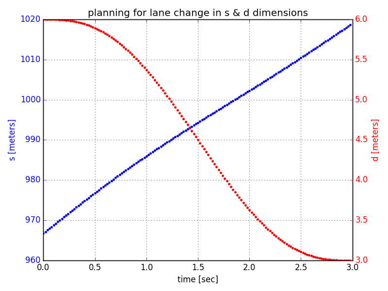
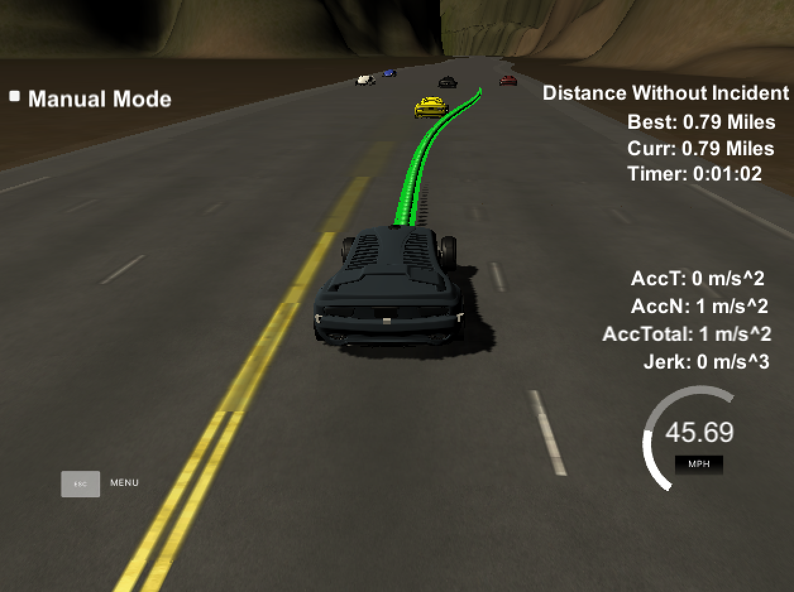
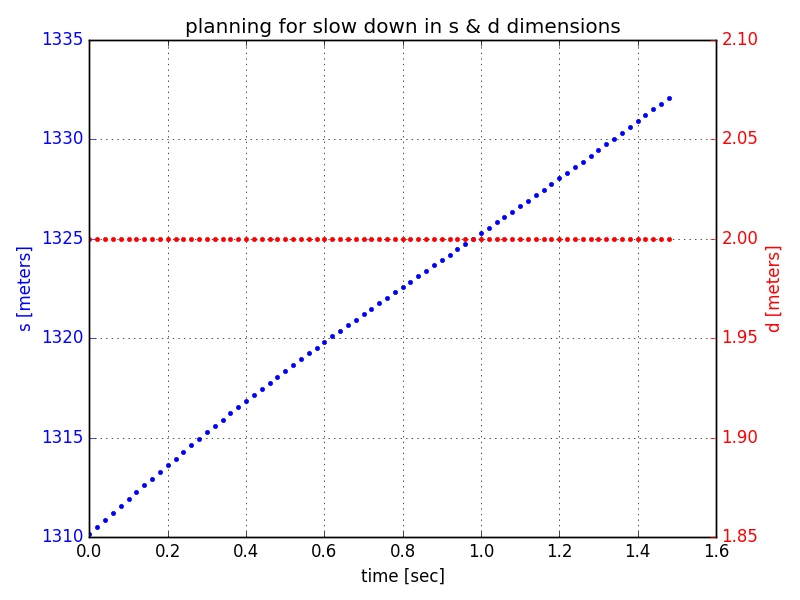

This is a discussion for the Udacity Self Driving Car ***Path Planning*** project:


# Problem description

In this project, the goal is to design a path planner that is able to create smooth, safe paths for the car to follow along a 3 lane highway with traffic.
A successful path planner will be able to keep inside its lane, avoid hitting other cars, and pass slower moving traffic all by using localization, sensor fusion, and map data.

The central steps of the path planner are as follow: (and can be seen in *main.cpp*)

```{r}
behavior_analyzer.sense_traffic(j[1]["sensor_fusion"], car_s);

behavior_analyzer.check_slowdown(own_car.s, own_car.d, own_car.vel);

trajectory_planner.calculate_trajectory(..)
```

## Sense traffic

Our vehicle constantly receives information about other  cars on the right-hand side of the road. This information includes frenet coordinates and velocity information.

Upon receive of new sensor information our car keeps a data structure of the closest car ahead & behind for each lane.

The functionality to sense other traffic is part of the behavior object and implemented in *behavior.cpp*

## Check for slow down

In addition to sensing other traffic, the behavior component reacts to traffic on the road.

A central piece is a very simple state machine, which incorporates the states: (defined in *behavior.h*)

```{r}
#define STATE_KL     1 // keep lane state (and go as fast as possible)
#define STATE_KL_SD  2 // keep lane state, but slow down
#define STATE_LC     3 // lane change state
```

The desired state is to stay on the current lane and drive with the maximal allowed speed.

However, if our latest information about surrounding traffic reports a too close car ahead (which can be stalled or just slowly moving), the planner tries to change lanes.

If it is safe to do so - i.e.,
- there is a big enough gap to the next car ahead and behind on the lane we want to turn into (if such a car even exists ahead or behind)
- and there is not a very fast moving car behind us (if exists) on the future lane, and
- and the car ahead on the future lane (if exists) is not much slower than us.

- Then the behavior component will reflect a "go ahead" for a lane change by changing its state to *STATE_LC*.

However, if one ore more constraints cannot be met, we have to slow down, which is reflected by state change to *STATE_KL_SD*.

If there is no close traffic ahead, we will be in the state *STATE_KL*, to denote to keep the current lane and go as fast as possible.

Intuitively, being on the middle lane, we have the option to switch to the left and right lane. On the outer lanes, we only have the option to merge into the middle lane.

All this logic is implemented in *behavior.cpp*

## Trajectory calculation

Trajectories are calculated no matter if we keep the lane, change the lane, or slow down.

However, based on the state the behavior object is in, we have different goals for our frenet s & d coordinates.

For example, if we have to slow down, the goal value for the frenet s component will be shorter as it would be if we would plan a trajectory for a situation where we can keep our maximum velocity.

Hence, the behavior component influences the trajectory generation component in its calculation for the next trajectory.

As discussed int the Udacity class, the strategy for trajectory generation is to separate the planning we do in the s dimension from the planning we do in the d dimension.

Influenced by the state of the vehicle, we feed in start-states (start s, start velocity, start acceleration) and end-states (goal s, goal velocity, goal acceleration) into a jerk minimizing polynomial solver along with the desired prediction horizon (*T*, in seconds).

Note, the prediction horizon is longer if we compute the trajectory for a lane change. This ensures a more smooth and pleasant transition.

Once we have computed jerk minimizing polynomials for the s and d dimension we compute the cartesian coordinates by using splines interpolating the race track.


The figure below shows an example of a jerk minimizing trajectory generation for a lane change.
The blue dotted line shows how values in the s-dimension are changing over time (time on x-axis in seconds). As we can see, frenet s values are almost linear.
More interesting are the d-values in red. We can see a change from the middle lane (d=6) to the left lane (d = 3). The goal is to avoid any too abrupt acceleration in the d dimension, which is reflected by the asymptotic behavior of the curve.

Also, one can see by the values of the x-axis the extended prediction horizon for such a lane change maneuver of 3 seconds.


Once cartesian coordinates are computed out of the jerk minimizing s & d trajectories using map interpolating splines, we feed the new path to the simulator. The green curve below demonstrates this new path.



In addition, below is an image showing s & d values for a slow down maneuver. d-values stay constant since we stay in the same lane. and s-values are sub-linear.



## Speed up by multi-threading

To speed up some of the computational costs of trajectory generation, we added some multi-threading constructs to the trajectory generation part in *trajectory.cpp*.

```{r}
#pragma omp parallel for shared(T, T_INC, next_x_vals, next_y_vals)
for(int i = 0; i < (int)(T / T_INC) ; i++) {
```

This ensures that the work generating trajectory coordinates is divided among multiple threads.
For small examples like this one, it probably won't speed up the calculation much, but could be interesting for real world examples.
